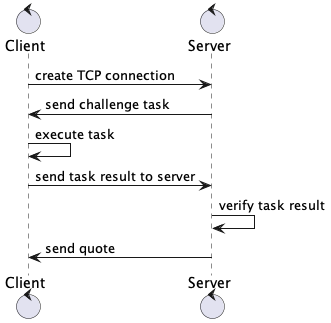

# powow

**Powow** is a "Word of Wisdom" server written in Go. 
Implements challenge-response based Proof-of-Work protocol for DDoS protection.

The health check is implemented based on the [argon2](https://pkg.go.dev/golang.org/x/crypto/argon2) library.
When the load metrics increase, the complexity of the challenge increases.



## Usage

Run server:
```shell
make server
```

Run client:
```shell
make client
```

A `client` is a CLI application that makes a single request.
If you want load tests, then run the following command:

```shell
make load
```

## Build

Build server locally:
```shell
make build-server
```

Build client locally:
```shell
make build-client
```

After executing these commands, the `./bin` directory will appear with `client` and `server` applications.
You can run it as `./bin/server` and/or `./bin/client`.

## Docker

Build server in docker:
```shell
make docker-build-server
```

Build client in docker:
```shell
make docker-build-client
```

Also, you can use prebuilt docker images:

```shell
docker run --rm -p 7700:7700 -d partydev/powow-server:latest
```

for client:
```shell
docker run --rm --network=host partydev/powow-client:latest
```